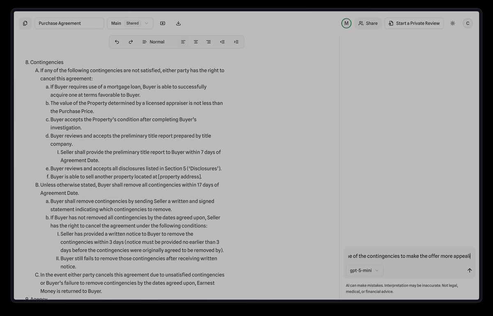

# Reach

A collaborative agreement negotiation platform for real estate, featuring AI-powered document review, real-time co-editing, and Stripe billing.



## Overview

Reach streamlines real estate transactions by giving agents and clients a shared workspace to draft, negotiate, and finalize agreements. Key capabilities include:

- **Real-time collaborative editing** — Multiple users edit the same document simultaneously via Yjs and Lexical
- **AI document review** — OpenAI-powered clause analysis, risk flagging, and suggested edits
- **Threaded comments** — Inline discussion on specific document sections
- **Stripe billing** — Subscription tiers (Starter, Pro, Max) with metered usage
- **Property data integration** — Bridge API for property lookups, Google Maps for location context

## Tech Stack

| Layer | Technology |
|-------|-----------|
| Frontend | Next.js 15, React 19, TypeScript, Tailwind CSS, Radix UI |
| Editor | Lexical, Yjs, y-websocket |
| Backend | Django 4.2, Django REST Framework, Channels (WebSockets) |
| Database | PostgreSQL, Redis |
| AI | OpenAI API |
| Payments | Stripe |
| Infrastructure | Gunicorn, Daphne, WhiteNoise |

## Project Structure

```
reach/
├── frontend/       # Next.js app (UI, editor, Stripe checkout)
├── backend/        # Django API (auth, documents, AI, billing)
├── y-websocket/    # Yjs WebSocket server (real-time sync)
└── assets/         # Demo GIF and static assets
```

## Local Development Setup

### Prerequisites

- Python 3.11+
- Node.js 18+
- PostgreSQL
- Redis

### Backend

```bash
cd backend
python -m venv venv
source venv/bin/activate
pip install pip-tools
pip-compile requirements.in
pip install -r requirements.txt

cp .env.example .env
# Fill in required values in .env

python manage.py migrate
python manage.py runserver
```

### Frontend

```bash
cd frontend
npm install

cp .env.local.example .env.local
# Fill in required values in .env.local

npm run dev
```

### Y-WebSocket Server

```bash
cd y-websocket
npm install
npm start
```

### Environment Variables

See [`backend/.env.example`](backend/.env.example) and [`frontend/.env.local.example`](frontend/.env.local.example) for the full list of required environment variables.

## License

This project is licensed under the MIT License. See [LICENSE](LICENSE) for details.
